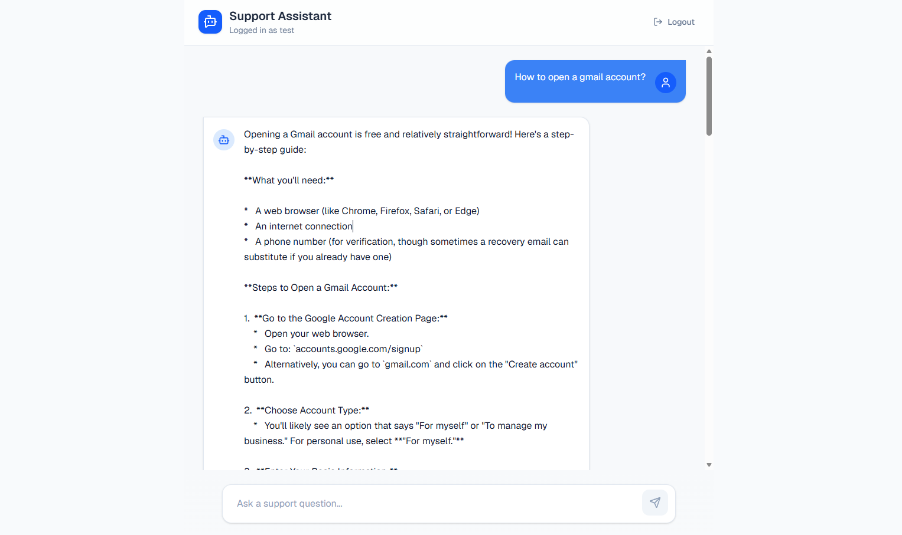

# Project Petray - AI Customer Support Assistant

A full-stack, AI-powered customer support application utilizing Next.js for the frontend, Node.js/Express for the backend, and Google's Gemini LLM via LangChain for intelligent conversational capabilities.

Live At - https://project-petray-frontend.vercel.app/




---

## Architecture Overview

This project is built as a monorepo containing two main parts:

1. **Frontend (`/frontend`)**
   - **Framework**: Next.js (App Router)
   - **Styling**: Tailwind CSS & Lucide React Icons
   - **Data Fetching**: Axios (Configured for global credential and cookie support)
   - **Features**: Responsive Chat UI, Secure Auth Context, Admin Dashboard, Dynamic Rating System.

2. **Backend (`/backend`)**
   - **Framework**: Node.js & Express
   - **Database**: MongoDB (Mongoose)
   - **AI/LLM**: `@langchain/google-genai` using the `gemini-2.0-flash-lite` model
   - **Security**: JWT Authentication via secure `HttpOnly` cookies, bcrypt password hashing.

---

## Setup Instructions

### Prerequisites
- Node.js (v18+ recommended)
- `pnpm` package manager
- MongoDB Database (Local or MongoDB Atlas)
- Google Gemini API Key

### 1. Clone the repository
Ensure you are in the root `Project_Petray` directory.

### 2. Backend Setup
1. Navigate to the backend directory:
   ```bash
   cd backend
   ```
2. Install dependencies:
   ```bash
   pnpm install
   ```
3. Create a `.env` file in the `backend/` directory:
   ```env
   PORT=3001
   MONGODB_URI=mongodb://localhost:27017/petray
   JWT_SECRET=your_super_secret_jwt_key
   GOOGLE_API_KEY=your_gemini_api_key
   GEMINI_MODEL=gemini-2.0-flash-lite
   FRONTEND_URL=http://localhost:3000
   ```
4. Run the database seeder to create an initial Admin account:
   ```bash
   pnpm run seed
   ```
   *(Default Admin Credentials: Username: `admin`, Password: `admin@321`)*
5. Start the backend development server:
   ```bash
   pnpm run dev
   ```

### 3. Frontend Setup
1. Open a new terminal and navigate to the frontend directory:
   ```bash
   cd frontend
   ```
2. Install dependencies:
   ```bash
   pnpm install
   ```
3. Create a `.env.local` file in the `frontend/` directory (optional if backend runs on port 3001):
   ```env
   NEXT_PUBLIC_API_URL=http://localhost:3001/api
   ```
4. Start the frontend development server:
   ```bash
   pnpm run dev
   ```

You can now visit the application at [http://localhost:3000](http://localhost:3000).

---

## API Documentation

The backend API is served at `http://localhost:3001/api`. All protected routes require a secure `HttpOnly` JWT cookie (`token`) to be attached to the request.

### Authentication (`/api/auth`)

* `POST /api/auth/register`
  * **Description**: Creates a new user account.
  * **Body**: `{ "username": "...", "password": "..." }`
  * **Returns**: User object and sets an HttpOnly cookie.

* `POST /api/auth/login`
  * **Description**: Authenticates an existing user.
  * **Body**: `{ "username": "...", "password": "..." }`
  * **Returns**: User object and sets an HttpOnly cookie.

* `GET /api/auth/me`
  * **Description**: Validates the current session cookie and returns user details.
  * **Returns**: Logged-in User object.

* `POST /api/auth/logout`
  * **Description**: Clears the session cookie.

### Chat System (`/api/chat`)

* `POST /api/chat`
  * **Description**: Sends a message to the Gemini LLM and saves the conversation.
  * **Body**: `{ "message": "Your prompt here" }`
  * **Returns**: `{ "id": "conversation_id", "response": "AI text response" }`
  * **Note**: Will return `503 Service Unavailable` with a friendly message if the Gemini API is experiencing high demand.

* `GET /api/chat/history`
  * **Description**: Retrieves the authenticated user's conversation history.
  * **Returns**: Array of conversation documents.

* `POST /api/chat/rating`
  * **Description**: Submits a rating (helpful/not helpful) for a specific AI response.
  * **Body**: `{ "conversationId": "id", "rating": 1 }` *(1 = Helpful, 0 = Not Helpful)*
  * **Returns**: Updated conversation document.

### Admin (`/api/admin`)

* `GET /api/admin/stats`
  * **Description**: Retrieves system statistics (Admin only).
  * **Returns**: `{ "totalUsers": number, "feedbacks": [ ...recent_rated_conversations ] }`
